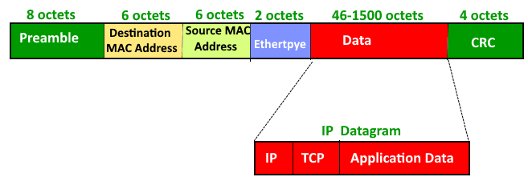
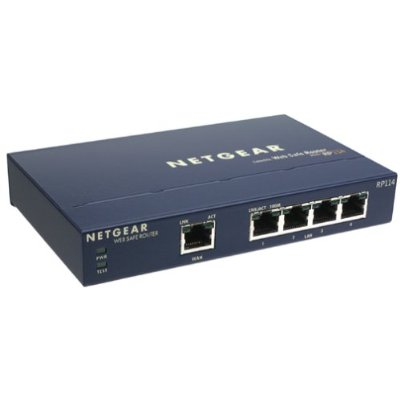

## Network Models
There are two main models that represent networks. The OSI and TCP/IP Model.

### OSI Model
1. Physical (Cables)
2. Data Link (Network cards, Switches, components with MAC Addresses)
3. Network (Routers, Logical Addresses, IP Addresses)
4. Transport (Assembly/Disassembly layer for packets)
5. Session (Connection between two systems)
6. Presentation (Converts data into a format your applications can use)
7. Application (Network aware components of an Application, API)

### TCP/IP Model
1. Network Interface Layer (Cables, MAC Addresses)
2. Internet (Routers, IP Addresses)
3. Transport (Assembly/Diassembly, TCP/UDP)
4. Application (OSI: Session, Presentation, Application altogether. Applications are seen as traditional Applications)

### How data is processed in OSI and TCP/IP


### MAC Addresses
Networked devices send and receive data in `frames` which have a maximum size of 1500 bytes and are created and destroyed by Network Interface Controllers (NIC).

A Media Access Control address of a device is a unique identifier assigned to a NIC. The MAC address is a 48-bit number (12 hexadecimal characters). The first 34 bit number is an Organizationally Unique Identifier (OUI).

When routers receive a frame from a single computer it sends it on to all other computers linked to that router. It is the MAC Address on the NIC that determines the fate of the frame it has received. 

On Windows we can find the MAC address with
```shell
ipconfig /all

Physical Address. . . . . . . . . : ??-??-??-??-??-??
```

Therefore, we add to our frame two MAC Addresses. Where its going to, and where it's coming from. A Cyclic Redunancy Check (CRC) is also added to verify the data is good. If the data is bad it can be resent. 

Once the hub receives the frame. It makes multiple copies of it, one for each computer its connected to and then sends the frame(s) to each networked computer. Each computer's NIC knows its own MAC address such that, when the frame arrives it knows whether the frame was meant for itself. If the frame was delivered to the correct address then it is passed upwards to the appropriate software.



### Broadcast vs Unicast
During Unicast situations the frame's destination MAC address is compared to the MAC address of the NIC that receives it. If they match, the MAC addresses are removed from the frame (the souce MAC address is kept in memory in order to send replies) and the frame is passed on to the appropriate software.
During broadcast situations, the dataframe's destination MAC address is set to FF-FF-FF-FF-FF-FF. And the receiving computer knows that the recieved dataframe is a `broadcast`. The most common uses for broadcasts are when one computer signals to every other on the local network requesting a return frame from a computer with a specific name (for example, `Dans-Windows-PC`). The return frame will bear the MAC address of `Dans-Windows-PC`.
A group of computers that can hear the broadcasts of the other computers is a `broadcast domain`.

### IP addressing
A fully connected network based solely on MAC addresses would be overwhelmed with all this broadcasting of frames. In order to make huge networks reduce the amount of network traffic another layer of addressing is added `logical addressing`. The most commonly used form is `IP addressing`. Unlike MAC addresses IP addresses are not fixed. 

Equipment such as routers tie IP and MAC addresses together. Routers tend to have two or more connections. An example router may be connected to a 4 port `switch` as shown below.



In order to ensure transfer of frames to the correct destination we add the IP addresses of the souce and destination. When we add the IP addresses to a frame we get a `packet`. When an IP packet is detected by a computer, if the destination IP address is not part of its own network the computer sends the IP address over the `default gateway` (invariably to the router). The router then adds its own MAC address (in addition to the MAC address of the source computer) and the MAC address of the destination computer (yes thats 3 MAC addresses) to the IP packet. The frame is sent from the computer, to the switch, to the router. At the router the MAC addresses are stripped and the router uses a `routing table` to find where to send the data. Router then adds his own MAC address and that of the destination computer. So, we are back to two MAC addresses on the dataframe that surrounds the IP packet. The IP packets remain unchanged during this process.

### Packets and Ports
We still have two issues to solve:
1. How does the data get to the right application?
2. How do we know all the data has arrived?

`Port numbers` are added to the packet (e.g., port 80 for http, and port 16394 for the `client` computer). When the `server` receives packets from a client with port 80 as the destination port it knows to send the data to the web serving application. Responses (such as web pages) are sent back to the IP and port number (16394 in this case) of the client. Of course, the destination/source IP and ports are reversed when data returns from server to client. In the case of browsing web pages, the port number of the client is specific to each web page. Thus, all packets for a specific page will contain the same port number.

The port number range runs from 0 - 65535.

The first 1024 ports are reserved.

Transmission Control protocol (TCP) is a connection-oriented conversation between two computers that insure complete transmission of data. This is achieved by `sequence numbers` and `acknowledgement numbers`.

User Datagram Protocol (UDP). UDP is not connection-oriented. and data is just sent regardless of whether the receiving computer is ready for it. Errors in transmission have to be handled at the receiving end. 